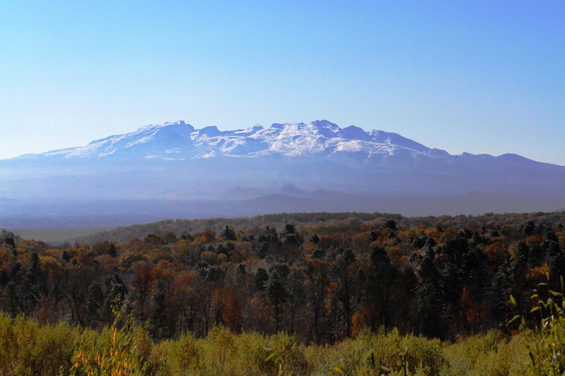

到长白山一游的想法已经很多年了，2014年终于成行！

9月28日从沈阳自驾出发，29/30日游览长白山北坡、西坡，10月1日返回沈阳，历时4日，行程约1200公里。

#### 在路上

由于前一天晚上下了一场雪，30日去长白山西坡的路上遇到了难得的秋日雪景，一路上心情大好！！！

 

 

#### 天池 
长白山必到之地就是天池，但由于山上天气变化多端，并非每次上山都能看到天池！幸运的是，我们29日、30日两天分别从北坡、西坡上山都看到了天池！

北坡，相机角度不够广啊！

这是合成的全景图：

西坡（相机斜过来，刚好放下全景，:-x）：

天池给人的感觉就是“静”和“净”，让人舍不得下山！

#### 山上风景

长白山不愧5A级景区的名头，随处都是美景、到处都是震撼。

山下，到处都是秋日的红！

区间车候车场，其中的中巴都是奔驰车，在曲折的山路上也奔跑如飞，有过山车的感觉！

 

山下云海，美极了！

#### 长白山瀑布

名头很大，可瀑布实际上很小，还不让靠近，多亏我带了长焦镜头:-x。

#### 温泉广场

长白山温泉属于高热温泉，多数泉水温度在摄氏60度以上，最热泉眼可达82度，可煮熟鸡蛋。由于长年流淌着温泉水，这一片区域全是绿色和黄色，估计泉水含硫较高。

#### 绿渊潭

潭水清澈见底，水温很低。

#### 大峡谷

鬼斧神工！

