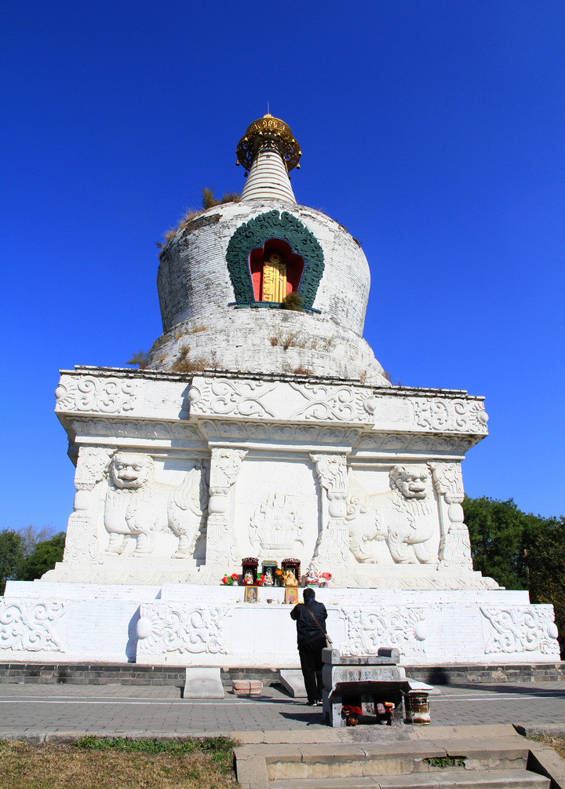

沈阳四塔是清太宗皇帝皇太极敕建的盛京（沈阳的旧称）城外东、南、西、北四座塔寺。据寺内石碑记载：“盛京四面各建庄严宝寺，每寺大佛一尊，左右佛二尊，菩萨八尊，天王四位，浮图一座，东为慧灯郎照，名曰永光寺；南为普安众遮，名曰广慈寺；西为虔祝圣寿，名为延寿寺；北为流通正法，名曰法轮寺。”四塔寺象征四大金刚威镇四方，护国安民，护佑 “国无祲灾”、“五福齐来”。

### 南塔广慈寺

相传南塔广慈寺中供奉的“千手千眼佛”，本是一位皇帝的三公主，美丽与善良并存，人称善公主。
现在附近的南塔鞋城的知名度远比南塔要高，知名不仅仅是因为那铺天盖地一般蔓延的鞋城，还有庞大的日杂市场，以及远近闻名的烧烤小吃巷子。

### 东塔永光寺

东塔，现在已经找不到永光寺的标记，没有寺庙的守护，生存在东塔公园里，养护工作做的也不好。

### 北塔法轮寺

北塔的保存最为完整，至今仍有不时会有佛事。2014年夏季去的时候正好还看看有人在给佛像做镀金处理。

### 西塔延寿寺

西塔延寿寺，由于这个“寿”字，与寿相关的一些佛事经常在这里举行。现在在沈阳说起西塔，可能更多人想到的是附近著名的朝鲜族商业区而不是西塔本身。另外，西塔还是惟一一座拆除后重建的塔。

